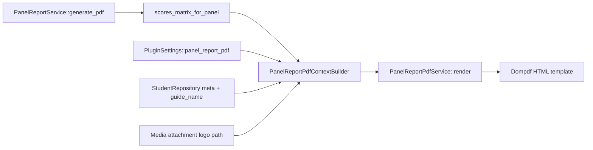

# Story 11.1: Panel coordinator — designation, consolidated report, PDF, and panel freeze

Status: review

<!-- Part A (panel coordinator, report API, basic PDF, freeze) shipped 2026-05-17. Part B (institutional PDF template) is the active dev scope. -->

## Story

As a **project coordinator**,
I want to designate one **panel coordinator** (panel head) per panel on the Reviewers wizard step,
So that they can consolidate and sign off panel scores for each review round.

As a **panel coordinator** (reviewer designated as panel head),
I want a separate **Panel report** flow alongside my normal marking assignment,
So that I can view all reviewers’ final scores for my panel, download a signable **institution-branded Review Report** PDF, and freeze the panel when ready.

As a **site administrator**,
I want to configure the panel report PDF letterhead, table columns, and signature blocks in **Project Reviews settings**,
So that each institution can print official review reports without code changes.

---

## Part A — Shipped (baseline)

Panel coordinator designation, panel-scoped scores API/UI, Dompdf export (basic layout), panel freeze, and PHPUnit coverage are **implemented**. Do not regress Part A behaviour.

| Delivered | Location |
|-----------|----------|
| `is_panel_head` on session + per-review roster | `Install.php`, `PanelRepository`, `ReviewAssignmentRepository` |
| Wizard + CSV panel coordinator | `PanelReviewersStep.jsx`, import handler |
| Panel report REST + UI | `class-rest-panel-reports.php`, `PanelReportPage.jsx` |
| Basic PDF | `PanelReportPdfService.php` (needs Part B rewrite of layout only) |
| Panel freeze | `PanelFreezeRepository`, `MarkService` guards |

---

## Part B — Institutional Review Report PDF (active scope)

### User requirements (source)

1. **Table borders:** all borders **1 pt**, **black** (`#000`).
2. **Sr. No.:** serial number column (1…n per panel student list).
3. **Student identity:** each row shows **reg no**, **student name**, and **attendance status** (`Present` / `Absent`) — attendance is review-level canonical data from story 5-7 (`pr_review_student_panels.attendance_status`), already on the on-screen panel report; PDF must include it beside the name (dedicated column, not omitted).
4. **Project title:** each student’s project title in the table.
5. **Guide name:** optional column; show only when enabled in settings; data from student registry (`guide_name` already exists).
6. **Reviewer column headers:** `Reviewer 1`, `Reviewer 2`, … (ordinal), **not** reviewer display names.
7. **Panel coordinator dedupe:** if the panel coordinator is also a panel reviewer, **one** signature line only (not “Panel coordinator” + “Reviewer: {name}”).
8. **Signatures:** remove per-line `Date:` fields; add section heading **Signatures with date** (blank line under heading for hand-written date).
9. **Head of department (right):** configurable **label** + **name** (e.g. label `Head of the Department`, value `Dr. Manivannan A`) with signature line, aligned on the **right** below the table.
10. **Report title block:** title **Review Report** (exact spelling per product); below it:
   - Review Number: `{review_label}`
   - Panel Name: `{panel_name}`
   - Reviewers: `{comma-separated reviewer names}` (full names in metadata only, not in table headers)
11. **Letterhead (top, centered):** configurable in settings — logo upload (default width **4 in**, configurable), Department Name, School Name, and **any additional ordered text lines**; center-aligned, bold, larger font for primary lines.

**Configuration surface:** extend **WP Admin → Project Reviews** settings (same pattern as story 9-3). Coordinator SPA “dashboard” continues to manage **student data** (guide, custom fields); PDF template toggles which student fields appear.

---

## Acceptance Criteria

### A. Panel coordinator & panel report (regression — Part A)

1. **Given** Part A behaviour **When** Part B ships **Then** all Part A acceptance criteria in git history remain true (wizard head, dual assignment CTAs, panel-scoped matrix, freeze guards, PDF endpoint returns `%PDF`).

### B. Report PDF layout & content

2. **Given** a generated panel report PDF **When** rendered **Then** every table cell border is **1 pt solid #000** (header, body, outer frame).

3. **Given** N students on the panel **When** the scores table renders **Then** the first column is **Sr. No.** with values `1`…`N` in stable sort order (same order as on-screen panel report: student name ascending unless template overrides).

4. **Given** panel report matrix data **When** the PDF table renders **Then** each student row includes:
   - **Reg no** (from `student.reg_no`)
   - **Student** name (from `student.name`)
   - **Attendance** immediately after the name column (or configured header, default `Attendance`) with human-readable **`Present`** or **`Absent`** derived from `student.attendance_status` (`present` | `absent` in API — same labels as `ReportsViewService::format_attendance_export()` and on-screen `attendanceStatusChip`)
   - **Given** `show_attendance: false` in template **Then** the attendance column is omitted (name column unchanged)
   - **Given** `attendance_status` is `absent` **Then** reviewer score cells still show `—` when totals are null (no regression to Part A absent handling)

5. **Given** student registry data **When** project title is configured for PDF **Then** each row includes the student’s project title from `guide_name`’s sibling field:
   - Prefer custom meta field key from template config (default key `project_title`).
   - If field missing/empty, cell is blank (no error).

6. **Given** PDF template has `show_guide_name: true` **When** PDF generates **Then** a **Guide** (or configured header) column shows `student.guide_name`; **Given** `show_guide_name: false` **Then** column omitted entirely.

7. **Given** R reviewers on the panel (stable order: same as `scores_matrix_for_panel` reviewer sort) **When** PDF table headers render **Then** score columns are labelled **Reviewer 1** … **Reviewer R** (never reviewer legal names in headers).

8. **Given** the report title section **When** PDF generates **Then** document shows centered/left-aligned block per template:
   - Heading: **Review Report**
   - Line: `Review Number: {review_label}`
   - Line: `Panel Name: {panel_name}`
   - Line: `Reviewers: {name1}, {name2}, …` (full roster names, comma-separated)

9. **Given** letterhead config with ordered blocks **When** PDF generates **Then** blocks render top-to-bottom, **center** aligned; text blocks use bold + larger font per `style` (`title` > `subtitle` > `body`); image block uses uploaded logo at configured width in inches (default **4**).

10. **Given** letterhead includes custom text blocks **When** admin adds rows in settings UI **Then** each row has `label` (optional), `value`, `sort_order`, and `style`; PDF respects order.

### C. Signature block

11. **Given** the scores table ends **When** signature section renders **Then** a heading **Signatures with date** appears (no automatic printed date, no per-row `Date: ______` placeholders).

12. **Given** panel reviewers including optional panel coordinator **When** signature lines render on the **left** **Then**:
    - One line per distinct signing role: **Reviewer 1**, **Reviewer 2**, … matching table column ordinals.
    - If user `user_id` is both panel coordinator and a reviewer, **only one** line for that ordinal (not duplicate “Panel coordinator” + “Reviewer n”).
    - Panel coordinator who is **not** in reviewer roster still gets a **Panel coordinator** line (if product keeps that role — default: **yes**, single line before Reviewer lines).

13. **Given** HoD settings `{ label, name }` **When** PDF generates **Then** on the **right** (same signature section, two-column layout or float-right block): printed label, printed name, signature line; defaults from settings example: label `Head of the Department`, name `Dr. Manivannan A`.

14. **Given** HoD name empty in settings **When** PDF generates **Then** right block shows label + blank signature line only (or hide block if `show_hod: false`).

### D. Settings & data plumbing

15. **Given** user with `pr_manage_settings` **When** they open WP Admin Project Reviews settings **Then** a **Panel report PDF** section allows:
    - Letterhead builder (add/remove/reorder blocks: logo, text).
    - Logo: media upload → stored as `attachment_id`; width in inches (default 4).
    - Preset text fields: Department name, School name (seed two blocks; editable).
    - Table options: toggles for Sr. No. (always on), **attendance column** on/off (default on), project title field key, guide column on/off; optional attendance column header override.
    - Signature: HoD label + name; optional show panel coordinator line.
    - Save persists to `pr_plugin_settings['panel_report_pdf']` via `PluginSettings::sanitize()`.

16. **Given** coordinator maintains students in Registry **When** guide or custom project title fields are filled **Then** PDF pulls live values on each download (no snapshot at freeze required for MVP).

17. **Given** reviewers set attendance during marking (story 5-7 / 5-14 consensus) **When** panel coordinator downloads PDF **Then** attendance reflects canonical `pr_review_student_panels.attendance_status` at download time (same source as `ReportsViewService::scores_matrix_for_panel` — field **already** on each student; Part B only adds PDF/UI rendering).

18. **Given** `GET .../panel-reports/.../pdf` **When** called **Then** server merges `scores_matrix_for_panel` payload + `PluginSettings::panel_report_pdf()` + resolved logo URL/path for Dompdf; **no** generation timestamp in PDF body (removed per req. 7/10).

### E. On-screen panel report (optional but recommended)

19. **Given** panel report page (`PanelReportPage.jsx`) **When** loaded **Then** table columns mirror PDF toggles where practical (Sr. No., reg no, student name, **attendance**, project title, guide) so WYSIWYG; **attendance must remain visible** (today: `ReportsScoresTable` with `showStatusColumn` — do not regress Part A).
20. **Given** on-screen table **When** Part B ships **Then** reviewer headers match PDF ordinals (`Reviewer 1`, …) for consistency (not display names in headers).

### F. Tests & regression

21. **And** `composer test` includes PDF tests asserting: 1 pt borders in HTML/CSS output, **Present/Absent in student rows**, Reviewer N headers, deduped signature HTML when head ∈ roster, letterhead blocks order, HoD block present.
22. **And** `npm run build` passes if coordinator settings N/A (admin-only); update tests if reviewer table headers change.

---

## Implementation plan (customizable architecture)

### Design goal

**One JSON template** drives PDF layout; admin UI is an editor for that JSON. Avoid hard-coding institution strings in PHP. Future stories can add per-project overrides by merging `session.meta.panel_report_pdf_override` without rewriting the renderer.

### Settings schema (stored in `pr_plugin_settings`)

```php
// PluginSettings::defaults()['panel_report_pdf']
[
  'styles' => [
    'table_border_pt' => 1,
    'table_border_color' => '#000000',
  ],
  'letterhead' => [
    'blocks' => [
      // Ordered list; drag-reorder in admin UI
      ['type' => 'image', 'attachment_id' => 0, 'width_in' => 4.0, 'align' => 'center'],
      ['type' => 'text', 'value' => '', 'style' => 'title'],      // Department name
      ['type' => 'text', 'value' => '', 'style' => 'subtitle'],  // School name
      // Admin may append: ['type'=>'text','value'=>'...','style'=>'body','label'=>'']
    ],
  ],
  'report' => [
    'title' => 'Review Report',
    'show_review_number' => true,
    'show_panel_name' => true,
    'show_reviewers_list' => true,
  ],
  'table' => [
    'show_sr_no' => true,
    'show_reg_no' => true,
    'show_student_name' => true, // always true in practice; column label "Student"
    'show_attendance' => true,
    'attendance_column_header' => 'Attendance',
    'project_title_field_key' => 'project_title', // pr_student_meta field_key
    'show_guide_name' => true,
    'guide_column_header' => 'Guide',
  ],
  'signatures' => [
    'section_heading' => 'Signatures with date',
    'show_panel_coordinator_line' => true,
    'panel_coordinator_label' => 'Panel coordinator',
    'reviewer_label_pattern' => 'Reviewer {n}', // {n} = 1-based ordinal
    'hod' => [
      'enabled' => true,
      'label' => 'Head of the Department',
      'name' => '',
    ],
  ],
]
```

### Rendering pipeline



**New class:** `PanelReportPdfContextBuilder` — enriches matrix payload:

- `reviewers[].ordinal` (1…R), `reviewers[].is_panel_coordinator`
- `students[].sr_no`, `students[].reg_no`, `students[].name`, `students[].attendance_status`, `students[].attendance_label` (`Present` | `Absent` — use same mapping as `ReportsViewService::format_attendance_export()`)
- `students[].project_title`, `students[].guide_name`
- `letterhead`, `signatures`, `styles` from settings
- `reviewer_names_line` for metadata

**Default PDF column order (left → right):** Sr. No. → Reg no → Student → Attendance → Project title (if enabled) → Guide (if enabled) → Reviewer 1…R → Review score.

**Refactor:** `PanelReportPdfService::build_html()` → delegate to `includes/views/panel-report-pdf.php` or private methods: `render_letterhead()`, `render_metadata()`, `render_table()`, `render_signatures()`.

### Signature dedupe algorithm

```
reviewers_ordered = panel roster by user_id sort (same as matrix)
coordinator_user_id = head for (review_id, panel_id)
signature_lines = []

if show_panel_coordinator && coordinator not in reviewers_ordered:
  add "Panel coordinator"

for each reviewer in reviewers_ordered with ordinal n:
  if user_id == coordinator_user_id && coordinator in roster:
    add single line: "Reviewer {n}"  // OR "Panel coordinator" — product pick: use Reviewer {n} only
  else:
    add "Reviewer {n}"
```

**Product default (this story):** when coordinator is in roster, **only** `Reviewer {n}` at their ordinal — no separate coordinator line.

### Student project title

- **Do not** add DB column unless necessary.
- Document in Registry: create custom field `project_title` (label “Project title”) via existing field definitions UI (`9-3` / Registry).
- PDF setting `project_title_field_key` points at meta key; empty → blank cell.

### Admin UI (WP Admin)

Extend `includes/admin/class-admin-settings.php`:

- Subsection **Panel report PDF**
- WordPress media picker for logo (`wp_enqueue_media`)
- Repeater for letterhead text blocks (simple: hidden JSON + Add line button; no React required per UX-DR34)
- HoD label/name text inputs
- Checkboxes: show guide, show panel coordinator signature

### API changes

- Extend `scores_matrix_for_panel` response (optional, for UI parity): include `guide_name`, `project_title`, `reviewer_ordinal` — backward compatible additive fields. **`attendance_status` is already present** on each student (do not remove).
- PDF endpoint unchanged path; behaviour change only.

### Dompdf/CSS notes

- Use `border: 1pt solid #000` on `table, th, td`.
- Letterhead: `text-align: center`; `.letterhead-title { font-size: 14pt; font-weight: bold; }`
- Logo: `` — Dompdf supports in/cm.
- Signature section: CSS `display: table; width: 100%` with left cell 55% / right cell 45%.
- Keep `DejaVu Sans`; disable remote assets except local attachment path for logo (`isRemoteEnabled` true only for `file://` or copied temp file — prefer base64 embed from attachment bytes for reliability).

### Phased delivery (dev order)

| Phase | Work | Risk |
|-------|------|------|
| 1 | `PluginSettings` schema + sanitize + defaults | Low |
| 2 | Admin settings UI + media upload | Medium |
| 3 | `PanelReportPdfContextBuilder` + extend matrix payload | Medium |
| 4 | PDF HTML template (layout, borders, columns, metadata) | Medium |
| 5 | Signature dedupe + HoD right column | Low |
| 6 | Panel report React table parity (optional AC 17) | Low |
| 7 | PHPUnit: HTML snapshots / string asserts | Low |

### Out of scope (Part B)

- Per-project template overrides (future: session-level JSON merge).
- PDF storage in media library / email attach.
- Digital signatures / e-sign.
- Landscape layout or multi-panel batch PDF.

---

## Tasks / Subtasks

### Part A (complete)

- [x] Schema, panel head, wizard, CSV, REST, UI, basic PDF, freeze, tests

### Part B (active)

- [x] **Settings:** extend `PluginSettings` with `panel_report_pdf` defaults, getters, sanitize (attachment_id, floats, repeater blocks)
- [x] **Admin UI:** letterhead repeater, logo upload + width, department/school seeds, table toggles, HoD fields (`class-admin-settings.php`)
- [x] **Data:** extend `ReportsViewService::scores_matrix_for_panel` with `guide_name`, `project_title` (meta), `is_panel_coordinator` on reviewers (keep existing `attendance_status`)
- [x] **Builder:** `PanelReportPdfContextBuilder.php` — ordinals, sr_no, `attendance_label`, signature plan, settings merge
- [x] **PDF:** rewrite `PanelReportPdfService` layout (letterhead, Review Report block, table, signatures); 1 pt black borders; remove generated date
- [x] **Registry doc:** ensure `project_title` custom field documented in Dev Notes / optional seed in install (non-breaking)
- [x] **UI (optional):** `PanelReportPage.jsx` + table component — column parity with PDF toggles
- [x] **Tests:** extend `PanelHeadTest` / new `PanelReportPdfTemplateTest.php` for headers, dedupe, borders, HoD block, **attendance column with Present/Absent for present vs absent students**
- [x] Run `composer test` and `npm run build`

---

## Dev Notes

### Terminology (10-1 alignment)

| Context | Label |
|---------|--------|
| User-facing | **Panel coordinator**; PDF title **Review Report** |
| User-facing project | **Project** not “session” in new copy |
| Code | `session_id`, `pr_sessions`, `PanelReportPdfService` |

### Critical files (Part B touch list)

**Backend**

- `includes/services/PluginSettings.php`
- `includes/admin/class-admin-settings.php`
- `includes/services/PanelReportPdfContextBuilder.php` — **new**
- `includes/services/PanelReportPdfService.php` — layout rewrite
- `includes/services/ReportsViewService.php` — payload enrichment
- `includes/views/panel-report-pdf.php` — **new** (optional extract)

**Frontend (optional)**

- `src/reviewer/pages/PanelReportPage.jsx`
- `src/coordinator/components/ReportsScoresTable.jsx` — or small `PanelReportScoresTable.jsx`

**Tests**

- `tests/PanelHeadTest.php` — extend PDF assertions
- `tests/PanelReportPdfTemplateTest.php` — **new**
- `tests/PluginSettingsTest.php` — **new** if missing

### Existing code to reuse

- **Attendance:** `ReviewAssignmentRepository::get_attendance_status()` / `ATTENDANCE_PRESENT` | `ATTENDANCE_ABSENT`; already on `scores_matrix_for_panel` students; UI chips in `markingGridUtils.attendanceStatusChip()`; export labels in `ReportsViewService::format_attendance_export()`. Panel report page already passes `showStatusColumn` on `ReportsScoresTable`.
- `guide_name` on `pr_students` — `StudentRepository`, Registry, CSV import.
- Custom fields — `FieldDefinitionRepository` + `pr_student_meta` for `project_title`.
- `PluginSettings` + `Admin_Settings` pattern from story 9-3.
- Dompdf ^3 — already in `composer.json`.
- Panel coordinator flag — `is_panel_head` on `pr_review_panel_reviewers`.

### Previous story intelligence

- **9-3:** WP Admin native UI only; no Tailwind on admin screens.
- **7-5 / 7-6:** `scores_matrix` column patterns; panel variant already filtered.
- **5-7 / 5-14:** Attendance is canonical per student per review; absent students skip score completeness on freeze — PDF must show **Absent** so signatories see why reviewer columns are `—`.
- **5-13:** Reviewer roster ordering — keep PDF ordinals consistent with matrix reviewer order.
- **Part A PDF:** replace title “Panel report” with “Review Report”; do not break freeze/PDF endpoint contract.

### Open questions (defaults chosen in AC)

1. **Panel coordinator line when not in roster:** show **Panel coordinator** signature line (default on).
2. **On-screen headers:** match PDF ordinals (AC 17 recommended).
3. **Review Report spelling:** exact string **Review Report** (not “Reveiw”).
4. **Logo remote loading:** embed logo as base64 in HTML for Dompdf reliability.

---

## Dev Agent Record

### Agent Model Used

Composer (Part B implementation)

### Completion Notes List

- **2026-05-17 (Part A):** Panel coordinator designation, panel report API/UI, Dompdf export, panel freeze, PHPUnit coverage — shipped.
- **2026-05-17 (Part B story):** Story extended with institutional PDF template requirements, settings schema, implementation plan, and acceptance criteria.
- **2026-05-17 (Part B):** `panel_report_pdf` settings schema + WP Admin UI (logo media picker, letterhead lines, table toggles, HoD). `PanelReportPdfContextBuilder` enriches matrix data (ordinals, attendance labels, signature plan, base64 logo). `PanelReportPdfService` renders Review Report layout (1 pt black borders, Reviewer N headers, signatures with date, HoD right column). Panel report UI uses ordinal headers and extra columns. PHPUnit: `PanelReportPdfTemplateTest`, `PluginSettingsTest`, extended `PanelHeadTest`. `./vendor/bin/phpunit` (260 tests) and `npm run build` pass.

### File List

- includes/services/PluginSettings.php
- includes/services/PanelReportPdfContextBuilder.php (new)
- includes/services/PanelReportPdfService.php
- includes/services/ReportsViewService.php
- includes/admin/class-admin-settings.php
- src/coordinator/components/ReportsScoresTable.jsx
- src/reviewer/pages/PanelReportPage.jsx
- tests/PluginSettingsTest.php (new)
- tests/PanelReportPdfTemplateTest.php (new)
- tests/PanelHeadTest.php
- tests/bootstrap.php

### Change Log

- 2026-05-17: Story created (Epic 11) — panel coordinator / report / PDF / freeze.
- 2026-05-17: Part A implemented.
- 2026-05-17: Part B specified — institutional Review Report PDF, configurable letterhead & signatures, detailed AC and architecture.
- 2026-05-17: Part B extended — student **attendance** (`Present` / `Absent`) column alongside name in PDF and on-screen WYSIWYG; reuses existing `attendance_status` from panel matrix API.
- 2026-05-17: Part B implemented — institutional PDF template, admin settings, context builder, UI parity, tests.
