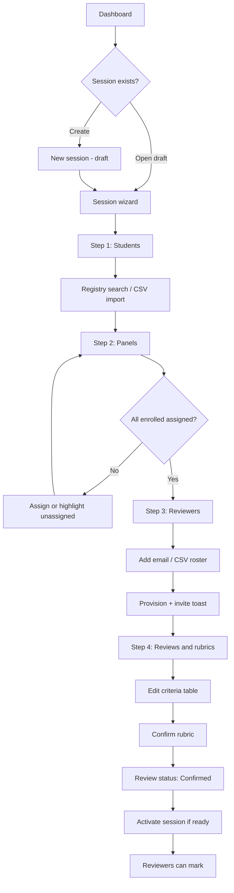
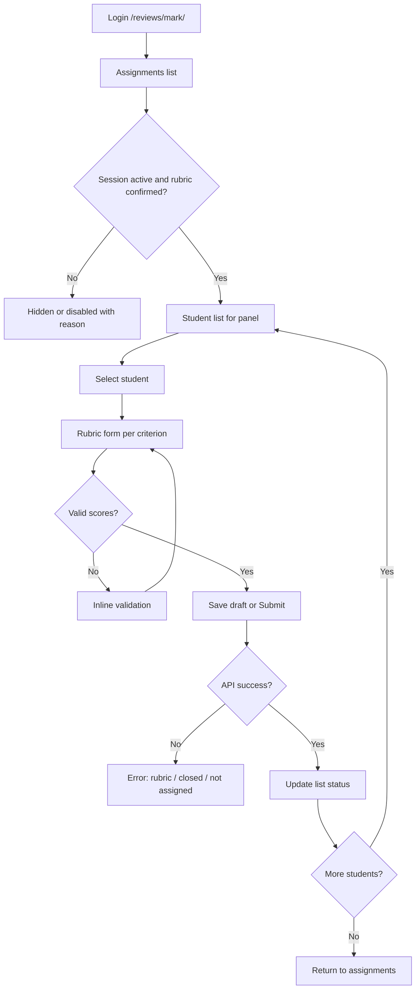
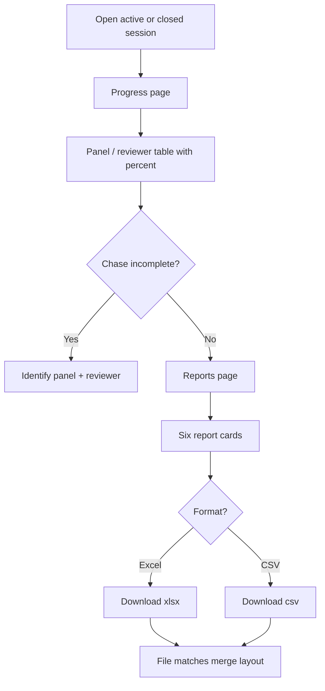
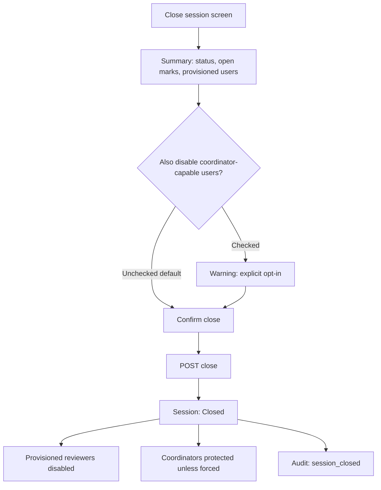
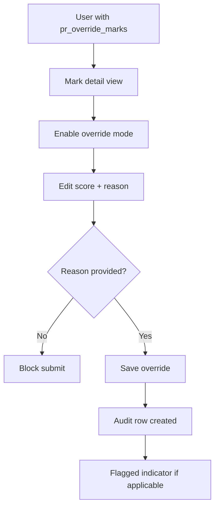

# UX Design Specification Project Reviews

**Author:** BMad
**Date:** 2026-05-16

---

## Executive Summary

### Project Vision

Project Reviews is a standalone WordPress marking application for academic project review events. It replaces spreadsheet-and-email workflows with a governed pipeline: student registry, session setup (panels, reviewers, confirmed rubrics), reviewer marking, server-computed weighted combined scores, and committee-ready exports. The experience must feel like a dedicated product—not the SAS Timetable theme—with clear separation between coordinator orchestration and reviewer execution.

### Target Users

**Coordinators** run one or more review sessions per term. They import or maintain the student registry, configure panels and reviewer rosters (including provisioned WordPress accounts), define and confirm rubrics, monitor marking progress, download six report types (Excel and CSV), and close sessions safely. They need guided setup, visible governance (rubric state, flagged marks), and trustworthy exports.

**Reviewers** sign in to see only their assignments for active sessions with confirmed rubrics. They enter draft or submitted marks per criterion in a focused flow: assignments → student list → rubric form. They are often time-constrained and may use provisioned credentials; the UI must minimize navigation and surface validation errors clearly.

**Administrators** configure plugin email/settings, manage capability defaults, and may override marks with mandatory audit reasons. They need transparency (audit log) and settings that do not require reading code.

### Key Design Challenges

1. **Two personas, one product identity** — Coordinator breadth vs reviewer focus without visual drift from the standalone brand.
2. **Lifecycle clarity** — Draft → active → closed sessions; draft → confirmed → unlocked rubrics; flagged marks after re-confirm must be unmistakable in UI and exports.
3. **High-stakes actions** — Confirm rubric, re-confirm with keep/clear, close session (with opt-in coordinator disable) require explicit, reversible-feeling patterns before commitment.
4. **Information density** — Rubric builder, progress by panel/reviewer, and report previews/downloads must remain scannable on desktop-first layouts.
5. **Export parity** — On-screen grouping (panel, review round, reviewer) should align with Excel merge semantics so coordinators trust downloads.

### Design Opportunities

1. **Session wizard as hero flow** — Card-based steps (students → panels → reviewers → reviews/rubrics) reduce setup errors and match coordinator mental model.
2. **Progress “control room”** — Panel/reviewer completion bars make chasing incomplete marking actionable before session close.
3. **Report gallery** — Six report cards with paired Excel/CSV actions make exports discoverable without a separate format decision.
4. **Reviewer marking funnel** — Narrow three-step path optimized for speed and assignment scoping (no access to unassigned students).
5. **Distinct academic product chrome** — Custom CSS variables, wordmark, and plugin-only shell reinforce trust and separation from timetable tooling.

## Core User Experience

### Defining Experience

Project Reviews centers on two complementary loops. For **reviewers**, the core action is entering criterion marks (draft or submitted) within assignment boundaries—fast, sequential, and guarded by rubric and session state. For **coordinators**, the core action is orchestrating a review session: wizard setup (students → panels → reviewers → rubrics), confirming rubrics to open marking, monitoring progress, exporting committee reports, and closing safely. The product succeeds when the path from confirmed rubric to trusted Excel export feels inevitable and error-resistant.

### Platform Strategy

Deliver as a **desktop-first web application** inside WordPress: two React SPAs on dedicated routes (`/reviews/`, `/reviews/mark/`) with a minimal plugin app shell (no theme assets). Interaction is **mouse/keyboard** optimized—data tables, multi-step wizards, and dense progress views. **Online-only** for MVP: all mutations via authenticated REST with nonce middleware. Coordinator navigation uses **HashRouter** to avoid rewrite conflicts. Branding and layout come solely from plugin CSS variables and components—visually and technically independent of the SAS Timetable theme.

### Effortless Interactions

- **Reviewer marking funnel:** Assignments → student list → single-student rubric form with inline max-marks validation and clear draft vs submit.
- **Coordinator session wizard:** Card-based linear steps with visible blockers (unassigned students, unprovisioned reviewers, unconfirmed rubrics).
- **Report downloads:** Six report cards; paired Excel and CSV buttons without a separate format picker.
- **Imports:** Column mapping remembered per import type; partial success with row-level errors and downloadable error CSV.
- **Scores:** Combined and level totals always server-computed—UI displays breakdowns, never editable aggregate fields.

### Critical Success Moments

1. **Rubric confirmed** — Coordinators and reviewers share a clear “marking is open” state.
2. **Progress insight** — Coordinator identifies incomplete panel/reviewer pairs before chasing people manually.
3. **Trusted export** — First Excel download matches expected panel/review/reviewer grouping and merge layout.
4. **Governed override** — Admin/coordinator override requires reason and appears in audit trail.
5. **Safe session close** — Marking stops; provisioned reviewers disabled; coordinator-capable users protected unless explicitly opted in.

### Experience Principles

1. **Govern before speed** — Reflect rubric and session lifecycle in UI states, copy, and disabled actions; never rely on users remembering server rules.
2. **One funnel per persona** — Coordinators live in wizard + dashboard + reports; reviewers live in a narrow three-step marking path.
3. **Exports are the deliverable** — Design information hierarchy to mirror Excel merge semantics (panel → review → reviewer).
4. **Scoped by default** — Show only what the user’s role and assignment permit; reduce navigation surface area.
5. **Standalone product identity** — Consistent plugin chrome, distinct from timetable tooling, credible for academic committees.

## Desired Emotional Response

### Primary Emotional Goals

Users should feel **in control** (coordinators), **focused** (reviewers), and **confident in fairness and data** (everyone). The product replaces spreadsheet anxiety with governed relief: rules are enforced visibly, scores are trustworthy, and exports are committee-ready. The emotional signature is **calm competence**—a professional academic instrument, not consumer entertainment software.

### Emotional Journey Mapping

| Stage | Desired feeling | Design lever |
|-------|-----------------|--------------|
| First login | Oriented, separate from timetable | Standalone app shell, wordmark, no theme chrome |
| Session setup | Guided, capable | Card-based wizard, visible blockers |
| Marking open | Clarity, fairness | Confirmed rubric state; scoped assignments |
| Active marking | Flow (reviewers), oversight (coordinators) | Narrow reviewer funnel; progress dashboard |
| Export | Accomplishment, trust | Report cards; Excel merges match mental model |
| Close session | Deliberate, safe | Summary + explicit opt-in for coordinator disable |
| Errors / blocks | Informed, not blamed | Plain-language errors with next step |

### Micro-Emotions

Prioritize **trust over skepticism** (read-only combined scores, audit trail), **confidence over confusion** (lifecycle badges, progress percentages), **calm over anxiety** (consequential actions use confirm patterns), and **accomplishment over frustration** (draft marks, partial imports, recoverable errors). Avoid dread from accidental lockout, suspicion of hidden totals, and panic from irreversible actions without preview.

### Design Implications

- Use **status chips and banners** for session, rubric, and flagged-mark state—never hidden state.
- **Reviewer UI** minimizes navigation depth and decision count per student.
- **Coordinator UI** surfaces “what’s incomplete” before “what’s done.”
- **Destructive flows** (unlock rubric, re-confirm, close session) use consequence summaries, not generic alerts.
- **Exports** look intentional (headers, merges)—supporting committee confidence.
- **Tone of copy** is direct, neutral, academic—no slang or gamification.

### Emotional Design Principles

1. **Calm competence** — Professional, restrained visual language; credibility for academic committees.
2. **Predictable consequences** — Users always know what will happen before they commit.
3. **Visible governance** — Fairness mechanisms (confirm, flag, audit, scope) are seen, not assumed.
4. **Quiet success** — Progress and completion signal relief, not celebration.
5. **Errors that teach** — Blocked actions explain why and who can fix it.

## UX Pattern Analysis & Inspiration

### Inspiring Products Analysis

**Google Sheets / Excel** — Users already think in rows, panels, and committee exports. Project Reviews should feel like a governed spreadsheet successor: structured imports, trustworthy totals, and Excel outputs that match on-screen grouping—not a live editable grid for all setup.

**Typeform-style wizards** — Linear session setup (students → panels → reviewers → rubrics) with visible step progress reduces coordinator cognitive load and prevents skipped prerequisites.

**Canvas / Moodle speed grader** — Reviewers expect a student list beside a rubric form, draft saves, and clear submit. The marking funnel should mirror this proven pattern with stricter assignment scoping.

**Airtable / Notion** — Card-based session lists with status properties (Draft, Active, Closed) support coordinator scanning and return visits without a dense admin table as the home screen.

**Stripe-style B2B dashboards** — Calm typography, restrained color, and consequence-first confirm dialogs align with “calm competence” for high-stakes close/unlock actions.

**WordPress admin** — Settings and capability documentation patterns are familiar to institutional hosts; reuse tabbed settings and help text, not timetable theme components.

### Transferable UX Patterns

**Navigation:** Hub dashboard → session context → specialized views (wizard, progress, reports, close). Separate coordinator and reviewer entry routes. Hash-based coordinator sub-routes to avoid rewrite conflicts.

**Interaction:** Wizard gating with visible blockers; paired Excel/CSV per report card; inline criterion validation; draft vs submitted marks; remembered CSV column mapping; provision toasts on reviewer add.

**Visual:** Card layouts for sessions and reports; dense progress tables with completion bars; lifecycle status chips (session, rubric, flagged marks); plugin CSS variables for standalone branding.

### Anti-Patterns to Avoid

- Spreadsheet-primary UI for session configuration (error-prone, no governance visibility).
- Hidden rubric or session state that allows marking when rules forbid it.
- Generic confirmation modals without consequence summaries.
- Loading `david-sas` or theme assets on plugin routes.
- Gamified feedback or playful illustration styles inappropriate for academic committees.
- Client-editable combined scores or ambiguous total displays.
- Single export control forcing format choice away from the report card context.

### Design Inspiration Strategy

**Adopt:** Multi-step session wizard with progress; reviewer assignments → list → rubric form; six report cards with dual download buttons; status chips and read-only score breakdowns; audit-visible overrides.

**Adapt:** Excel merge semantics for exports only; WordPress settings page for email and capabilities; Airtable-like session cards instead of full database UI; Stripe-like confirm patterns for destructive coordinator actions.

**Avoid:** Timetable branding and navigation; editable aggregates; irreversible actions without preview; consumer-style delight patterns; format-picker friction on every download.

## Design System Foundation

### 1.1 Design System Choice

**Tailwind CSS utilities + Project Reviews design tokens (`app-shell.css`) + a small shared React component library** built in `src/shared/`. Selective use of `@wordpress/components` for accessibility primitives (notices, spinners, base form controls) where they do not impose block-editor styling.

This is a **themeable custom system**: Tailwind provides layout, spacing, and responsive patterns; CSS custom properties define brand; shared React components (Card, StatusChip, DataTable, WizardStep, ReportCard, ConfirmDialog) ensure consistency across coordinator and reviewer apps.

### Rationale for Selection

- **Standalone product identity** requires full control of color, typography, and chrome—prebuilt systems (Material, Ant) carry recognizable aesthetics that conflict with separation from SAS Timetable.
- **MVP velocity** favors utility-first styling and a thin component layer over building every pattern from scratch or adopting a heavy component framework.
- **Spec and implementation plan** already prescribe plugin-owned `app-shell.css` with CSS variables and Tailwind-friendly structure.
- **Dual SPAs** (coordinator + reviewer) benefit from shared tokens and components without sharing a monolithic UI kit dependency.
- **Emotional goals** (calm competence) are easier with a restrained token set than with default Material/Ant themes.

### Implementation Approach

1. **Design tokens** in `assets/css/app-shell.css` (`:root` variables for color, surface, text, radius, shadow, font stack).
2. **Tailwind** configured in the plugin webpack pipeline (`@wordpress/scripts` + `tailwindcss` postcss plugin); scope utilities to `#pr-root` if needed to avoid bleed.
3. **Shared components** under `src/shared/components/` — Button, Card, StatusChip, PageHeader, DataTable, ProgressBar, WizardNav, ReportCard, EmptyState, ConfirmDialog.
4. **Coordinator / reviewer apps** import shared components only; no `david-sas` assets.
5. **WP Admin settings** — native WordPress admin markup/styles for the settings page; not Tailwind.
6. **Documentation** — token table in this UX spec and inline comments in `app-shell.css`.

### Customization Strategy

- **Brand:** Adjust tokens only (`--pr-color-primary`, etc.); components consume tokens via Tailwind theme extension mapping to CSS variables.
- **Density:** Desktop-first; table row height and card padding tuned for coordinator data density; reviewer forms slightly more spacious for focus.
- **Status semantics:** Fixed chip variants — `draft`, `active`, `closed`, `confirmed`, `unlocked`, `flagged` — mapped to token pairs (background + text).
- **No timetable imports:** Enforce via build/config — plugin bundle must not reference theme paths.
- **Future:** Extract tokens to a formal style guide if design matures; dark mode out of MVP scope.

## 2. Core User Experience

### 2.1 Defining Experience

The defining experience is **governed marking with a trusted handoff**: a coordinator confirms a rubric, reviewers enter criterion marks only for their assignments, and the coordinator exports committee-ready Excel/CSV where totals and groupings match the rules everyone operated under.

If this loop works—**confirm → mark → export**—the product wins. Everything else (registry, provisioning, audit, close) exists to make that loop fair, visible, and repeatable.

**Reviewer micro-defining interaction:** “Pick student → score criteria → submit” in under a minute per student when familiar.

**Coordinator micro-defining interaction:** “See what’s incomplete → chase → download reports” without opening a spreadsheet.

### 2.2 User Mental Model

Users arrive with a **spreadsheet + email mental model**:

- Students belong to **panels**; reviewers mark **their** panel.
- **Review 1 / Review 2** are rounds with different rubrics—not the same as “panel.”
- **Marks** are per criterion; **totals** are computed, not typed.
- **Excel** is what committees expect; the app is the system of record before export.

**Confusion risks to design away:**

- Panel vs review round (use consistent labels and wizard order).
- Marking before rubric confirm (block + explain).
- Editing combined scores (never offer; show breakdown only).
- Theme vs plugin (“this is Project Reviews, not timetable”).

### 2.3 Success Criteria

1. Reviewer completes one student’s rubric and sees clear **draft vs submitted** state without error.
2. Coordinator confirms rubric and **at least one reviewer** can mark within the same session context.
3. Progress view shows **accurate % complete** per panel/reviewer before close.
4. First **Excel download** matches panel/review structure users saw in progress/marks views.
5. **Close session** blocks new marks and disables only the intended provisioned accounts.
6. Override (if used) appears in **audit** with reason—no silent changes.

**“This just works” signals:** Status chips match reality; server errors name the fix (“Rubric not confirmed—ask coordinator”); imports succeed partially with readable error CSV.

### 2.4 Novel UX Patterns

**Mostly established patterns** with a **governance twist**:

| Pattern | Established from | Our twist |
|---------|------------------|-----------|
| Session wizard | Typeform, setup wizards | Hard gates: unassigned students, unconfirmed rubrics |
| Speed grader | LMS | Stricter assignment scope + flagged marks after rubric change |
| Report gallery | SaaS export hubs | Six fixed report types × Excel + CSV side by side |
| Status-driven UI | Notion/Airtable | Academic lifecycle: session + rubric + flagged mark |

**Novel (light):** Re-confirm rubric with **keep & flag** vs **clear**—requires a dedicated consequence dialog, not a generic confirm.

### 2.5 Experience Mechanics

**Coordinator: Confirm → monitor → export**

1. **Initiation:** Dashboard → open session → wizard or Reviews step.
2. **Interaction:** Build criteria table → **Confirm** → session active for marking.
3. **Feedback:** Review shows `Confirmed` chip; progress page fills; reviewers report they can mark.
4. **Completion:** Reports page → Download Excel/CSV per card → optional Close session with safety summary.

**Reviewer: Assignments → student → rubric**

1. **Initiation:** `/reviews/mark/` → assignment card (session + review + panel).
2. **Interaction:** Student list → rubric form (criterion inputs, max validation) → Save draft / Submit.
3. **Feedback:** Inline validation; submitted row visually distinct; blocked state explains rubric/session.
4. **Completion:** Return to list; next student; panel completion implied by list progress.

**Failure paths:** Rubric not confirmed, session closed, not assigned → full-page or inline banner with **who can fix** (coordinator vs admin).

## Visual Design Foundation

### Color System

Project Reviews uses a **restrained academic palette** distinct from SAS Timetable. Tokens live in `app-shell.css` and map to Tailwind theme extensions.

| Token | Value | Semantic use |
|-------|-------|----------------|
| `--pr-color-primary` | `#1e4d6b` | Brand, primary actions, active nav |
| `--pr-color-primary-hover` | `#163a52` | Primary hover |
| `--pr-color-surface` | `#f6f8fa` | Page background |
| `--pr-color-surface-raised` | `#ffffff` | Cards, modals, table body |
| `--pr-color-border` | `#d0d7de` | Dividers, inputs |
| `--pr-color-text` | `#1f2328` | Primary text |
| `--pr-color-text-muted` | `#656d76` | Labels, hints |
| `--pr-color-success` | `#1a7f37` | Confirmed rubric, submitted marks |
| `--pr-color-warning` | `#9a6700` | Unlocked rubric, flagged marks |
| `--pr-color-danger` | `#cf222e` | Errors, destructive actions |
| `--pr-color-info` | `#0969da` | Info banners |

**Status chips:** `draft` (neutral `#eaeef2` / `#656d76`), `active` (primary tint), `closed` (muted), `confirmed` (success tint), `unlocked` (warning tint), `flagged` (warning + flag icon).

### Typography System

- **Font stack:** `system-ui, -apple-system, BlinkMacSystemFont, "Segoe UI", sans-serif`
- **No webfonts in MVP** — fast load, institutional neutrality
- **Type scale:**

| Role | Size | Weight | Line height |
|------|------|--------|-------------|
| Page title | 32px | 600 | 1.25 |
| Section heading | 24px | 600 | 1.3 |
| Card title | 20px | 600 | 1.35 |
| Body | 16px | 400 | 1.5 |
| Table / UI | 14px | 400 | 1.45 |
| Caption / chip | 12px | 500 | 1.4 |

- **Numbers:** `font-variant-numeric: tabular-nums` on marks, scores, and progress %
- **Wordmark:** “Project Reviews” in page header — primary color, 20px semibold

### Spacing & Layout Foundation

- **Spacing scale:** 4px base — 4, 8, 12, 16, 24, 32, 48
- **App layout:** Fixed top bar (56px); coordinator left sidebar (240px); content area scrollable
- **Max content width:** 1280px centered
- **Cards:** padding 24px; gap 16px; border 1px `--pr-color-border`; radius 8px; subtle shadow `0 1px 3px rgba(0,0,0,.08)`
- **Tables:** full-width; sticky header; row height 44px (coordinator), 48px (reviewer list)
- **Wizard:** horizontal step indicator; step content max-width 960px
- **Reviewer:** single-column form max-width 640px centered for focus

### Accessibility Considerations

- Meet **WCAG 2.1 AA** contrast for text and interactive elements on default surfaces
- **Focus indicators** on all buttons, links, inputs (`outline` / ring using primary)
- **Do not rely on color alone** for state — pair chips/icons with text labels
- **Form errors** linked via `aria-describedby`; announce save/submit result via live region
- **Destructive dialogs** trap focus and require explicit confirm action
- **Motion:** respect `prefers-reduced-motion` for progress animations

## Design Direction Decision

### Design Directions Explored

Six directions were prototyped in `ux-design-directions.html`:

1. **Structured Academic** — Left sidebar, session cards, primary `#1e4d6b` (recommended).
2. **Green Institutional** — D1 layout with `#2d6a4f` primary.
3. **Data-Dense** — Table-first session list; minimal cards.
4. **Card-Forward Airy** — Larger cards, purple accent, more whitespace.
5. **Top Nav Hub** — Horizontal navigation under top bar.
6. **Formal Committee** — Dark primary bar, export-oriented copy.

### Chosen Direction

**Direction 1 — Structured Academic** for both coordinator (`/reviews/`) and reviewer (`/reviews/mark/`) apps.

### Design Rationale

- Aligns with spec §10 UI map (dashboard, wizard, reports, focused reviewer UI).
- Supports emotional goals: calm competence, clear hierarchy, committee credibility.
- Sidebar navigation scales to registry, progress, reports, and session wizard without timetable confusion.
- Session cards with status chips and progress bars match coordinator mental model from Airtable/Notion patterns.
- Reviewer mock keeps narrow list → rubric form funnel (LMS speed-grader pattern).

### Implementation Approach

- **App shell:** Top bar (wordmark + user) + left sidebar (coordinator only).
- **Dashboard:** Session cards in responsive grid (1–3 columns).
- **Wizard:** Full-width content with horizontal step indicator (Students → Panels → Reviewers → Rubrics).
- **Reports:** 2×3 or 3×2 grid of report cards with paired Excel/CSV buttons.
- **Reviewer:** No sidebar; top bar + centered content column (max ~640px on rubric form).
- Reference `ux-design-directions.html` tab **1** during React component implementation.

## User Journey Flows

### Coordinator: Session Setup and Open Marking

**Goal:** Create a session, enrol students, assign panels/reviewers, define rubrics, and confirm so marking can begin.

**Entry:** `/reviews/` dashboard → Create session or open draft session → Session wizard.

**Success:** Rubric `Confirmed`, session `Active`, progress page shows expected rows.

**Errors:** Import partial failure → error CSV; duplicate reg_no → update/skip policy; unassigned students block wizard advance.

### Reviewer: Mark Assigned Students

**Goal:** Enter draft or submitted marks per criterion for students on assigned panels only.

**Entry:** `/reviews/mark/` → Assignment card (session + review + panel).

**Success:** Submitted marks visible; cannot edit after session closed.

**Recovery:** Draft saves on failure; clear message if rubric locked.

### Coordinator: Monitor Progress and Export Reports

**Goal:** See completion by panel/reviewer and download committee reports.

**Entry:** Session context → Progress or Reports in sidebar.

**Success:** Excel merges match panel/review structure; CSV flat where specified.

### Coordinator: Close Session Safely

**Goal:** End marking and disable provisioned reviewer accounts without accidental coordinator lockout.

**Entry:** Session → Close session screen.

**Success:** Mark POST returns `session_closed`; audit records disable actions.

### Admin: Override Mark with Audit

**Goal:** Change a mark with mandatory reason; visible in audit export.

### Journey Patterns

| Pattern | Use |
|---------|-----|
| Hub → session context | Dashboard cards drill into session-scoped sidebar nav |
| Linear wizard with gates | Setup steps; block advance on unassigned / unconfirmed |
| Three-step reviewer funnel | Assignments → list → form |
| Paired export actions | Excel + CSV on same report card |
| Consequence confirm | Close session, unlock/re-confirm rubric |
| Status chips | Session, rubric, mark flagged, student row submitted/draft |

### Flow Optimization Principles

1. **Minimize steps to first mark** — Remember CSV mappings; bulk import; provision on reviewer add.
2. **One primary action per screen** — Confirm rubric, Submit marks, Download report, Close session.
3. **Show blockers before success paths** — Unassigned students, unconfirmed rubrics, incomplete progress.
4. **Recover without data loss** — Draft marks, partial imports, downloadable error CSV.
5. **Explain blocks in user language** — Map API codes to coordinator/reviewer next steps.

## Component Strategy

### Design System Components

**From Tailwind + CSS tokens (`app-shell.css`):**

- Layout utilities (flex, grid, spacing, responsive breakpoints)
- Typography scale (page title → caption)
- Form primitives styled with token borders/focus rings

**From `@wordpress/components` (selective):**

- `Spinner` — loading states
- `Notice` — success/error banners (mapped to token colors)
- Optional: `Modal` base if accessible focus trap is needed quickly

**Not used:** Block editor components, theme components, full WP component skin on front-end routes.

### Custom Components

#### AppShell
**Purpose:** Top bar + optional sidebar + `#pr-root` content area.  
**States:** Coordinator (sidebar) vs reviewer (no sidebar).  
**Accessibility:** `nav` landmark, skip link to main content.

#### SessionCard
**Purpose:** Dashboard session summary with status and progress.  
**Content:** Title, status chip, progress bar, click to open session.  
**Variants:** Draft, Active, Closed.

#### StatusChip
**Purpose:** Lifecycle labels for session, rubric, marks.  
**Variants:** `draft`, `active`, `closed`, `confirmed`, `unlocked`, `flagged` — fixed color pairs from tokens.

#### WizardNav
**Purpose:** Horizontal steps (Students → Panels → Reviewers → Rubrics).  
**States:** Current, complete, blocked (with tooltip reason).  
**Behavior:** Click completed steps to review; cannot skip blocked steps.

#### RubricTable
**Purpose:** Editable criteria (label, max marks, weight).  
**States:** Editable (draft/unlocked), read-only (confirmed), flagged indicator on affected marks.  
**Actions:** Save, Confirm, Unlock (coordinator only).

#### ReportCard
**Purpose:** One of six report types with description.  
**Actions:** Download Excel, Download CSV (side by side).  
**States:** Loading download, error toast.

#### ProgressTable
**Purpose:** Panel × reviewer completion with % and bar.  
**Content:** Panel name, reviewer name, completed/total, percent.

#### ConfirmDialog
**Purpose:** Destructive / consequential actions.  
**Content:** Title, bullet list of consequences, primary/secondary buttons.  
**Variants:** Close session (includes checkbox for coordinator disable), Re-confirm rubric (keep_flag vs clear).

#### CsvImportMapper
**Purpose:** Column mapping UI for student/reviewer/enrol imports.  
**Behavior:** Persist mapping to `localStorage`; show preview rows; display import summary.

#### RubricForm (reviewer)
**Purpose:** Criterion inputs for one student.  
**States:** Draft, Submitted; validation against `max_marks`.  
**Actions:** Save draft, Submit.

#### ScoreBreakdown
**Purpose:** Read-only per-review and combined scores.  
**Content:** Reviewer totals, review scores, combined — never editable.

#### EmptyState
**Purpose:** No sessions, no assignments, no audit rows.  
**Content:** Minimal copy; CTA button.

### Component Implementation Strategy

- All shared components in `src/shared/components/`; barrel export `index.js`.
- Consistent props: `variant`, `size`, `disabled`, `loading`.
- Consume CSS variables via Tailwind theme extension.
- Coordinator-only components in `src/coordinator/components/` when not reused.
- No Storybook for MVP; flows validated via manual E2E checklist.

### Implementation Roadmap

| Phase | Components | Maps to plan |
|-------|------------|--------------|
| 1 | AppShell, PageHeader, Button, EmptyState, SessionCard | Tasks 12–13 |
| 2 | WizardNav, CsvImportMapper, StatusChip, RubricTable, ConfirmDialog | Task 14 |
| 3 | RubricForm, Notice integration | Task 15 |
| 4 | ProgressTable, ReportCard | Tasks 16–19 |
| 5 | ConfirmDialog (close), ScoreBreakdown, override UI | Tasks 17, 20 |

## UX Consistency Patterns

### Button Hierarchy

| Level | Use | Style |
|-------|-----|-------|
| **Primary** | One main action per screen (Confirm rubric, Submit marks, Close session) | Filled `--pr-color-primary`, white text |
| **Secondary** | Alternate path (Save draft, Cancel, Back) | Outline border, primary text |
| **Tertiary / ghost** | Low emphasis (View audit, Resend credentials) | Text link or ghost button |
| **Destructive** | Unlock rubric, clear marks, force disable | Danger color; always in ConfirmDialog |

**Rules:** Never two primary buttons side by side; destructive never standalone without consequence dialog.

### Feedback Patterns

| Type | Component | When |
|------|-----------|------|
| **Success** | Notice (green) or toast | Import complete, mark saved, credentials sent |
| **Error** | Notice (red) + inline field errors | API failure, validation |
| **Warning** | Notice (amber) | Unlock rubric, partial import, weight change after marks |
| **Info** | Banner | Rubric not confirmed — explains who can fix |
| **Loading** | Spinner on button or table skeleton | REST in flight, export generating |

**API error mapping:** `rubric_not_confirmed`, `session_closed`, `not_assigned` → fixed user-facing strings (not raw codes).

### Form Patterns

- Labels above inputs; required marked with asterisk + `aria-required`.
- Inline validation on blur and submit; `max_marks` shown as “Score (0–{max})”.
- Rubric table: tabular numeric inputs with `inputmode="decimal"`.
- Import mapper: dropdown per required column; preview first 3 rows before submit.
- Override: reason `textarea` required; minimum 10 characters.

### Navigation Patterns

- **Coordinator:** Sidebar persistent; breadcrumb in page title (`Sessions › B.Tech 2026 › Wizard`).
- **HashRouter** routes: `#/`, `#/session/:id/wizard`, `#/session/:id/progress`, `#/registry`.
- **Reviewer:** No sidebar; back link from rubric form → student list → assignments.
- Active nav item: primary tint background in sidebar.

### Additional Patterns

**Modals:** ConfirmDialog only for consequential actions.

**Empty states:** Headline + one sentence + primary CTA.

**Loading:** Table skeleton for progress; button spinner for saves/downloads.

**Search:** Registry student search debounced 300ms; session list filter by status chips.

**Flagged marks:** Warning chip + tooltip “Rubric changed after marking”.

**Downloads:** “Download Excel” then “Download CSV”; disable buttons during fetch.

## Responsive Design & Accessibility

### Responsive Strategy

**Desktop (primary — 1024px+):**
- Full sidebar + content layout; multi-column session card grid (up to 3 columns).
- Data tables with sticky headers for progress and registry.
- Wizard step indicator horizontal; rubric table full width.

**Tablet (768px–1023px):**
- Sidebar collapses to hamburger drawer (coordinator).
- Session cards 2 columns; tables horizontal scroll with shadow cue.
- Reviewer rubric form single column; 44px min touch targets on buttons.

**Mobile (< 768px) — supported, not primary:**
- Coordinator: hamburger nav; cards stack single column; wizard steps vertical list.
- Reviewer: assignments and student list usable; rubric form full width.
- Reports: cards stack; download buttons full width stacked.

### Breakpoint Strategy

| Token | Min width | Layout change |
|-------|-----------|---------------|
| `sm` | 640px | Increased card padding |
| `md` | 768px | 2-col cards and assignment grids |
| `lg` | 1024px | Persistent coordinator sidebar 240px; marking table; 3-col dashboard |
| `xl` | 1280px | Max content width centered |

**Mobile-first CSS:** Unprefixed / base rules apply to narrow viewports first; wider layouts are added with `min-width` media queries and Tailwind `sm:` / `md:` / `lg:` prefixes (e.g. `flex-col sm:flex-row`, `grid-cols-1 lg:grid-cols-3`). Custom shell CSS in `assets/css/app-shell.css` uses the same pattern (drawer sidebar by default; `min-width: 1024px` for persistent sidebar). **Product priority (NFR11) is unchanged:** desktop 1024px+ remains the primary design target; mobile is supported, not primary.

### Accessibility Strategy

**Target: WCAG 2.1 Level AA**

- Color contrast ≥ 4.5:1 body text, ≥ 3:1 large text/UI components.
- Status never conveyed by color alone (chip text + icon).
- Full keyboard navigation with visible focus rings.
- Skip link: “Skip to main content” in AppShell.
- Semantic HTML and table headers with `scope`.
- `aria-live="polite"` for save/submit notices; `aria-describedby` for errors.
- ConfirmDialog: focus trap, `role="dialog"`, `aria-modal="true"`.
- Respect `prefers-reduced-motion` for progress animations.

### Testing Strategy

**Responsive:** Chrome, Firefox, Safari, Edge at 1280, 1024, 768, 375 widths; iPad viewport for reviewer flow.

**Accessibility:** axe DevTools or eslint-plugin-jsx-a11y; keyboard-only walkthrough; VoiceOver smoke test on rubric form and ConfirmDialog.

**E2E:** Accessibility checks in `tests/e2e/MVP_CHECKLIST.md`.

### Implementation Guidelines

- Use `rem` for typography; `fr`/`%` for grid columns.
- Sidebar toggle: `aria-expanded` on menu button.
- Tables: `overflow-x: auto` wrapper when needed.
- Download buttons include format in label text.
- Do not disable browser zoom.
- WP Admin settings: native WP admin a11y patterns (separate from SPA).
